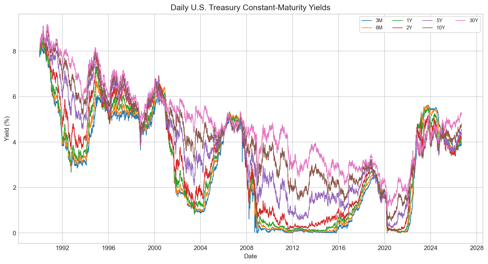
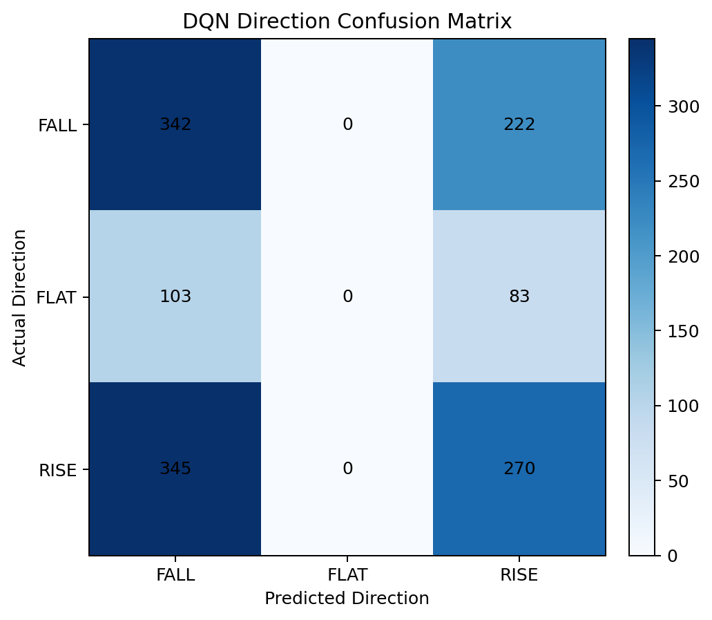
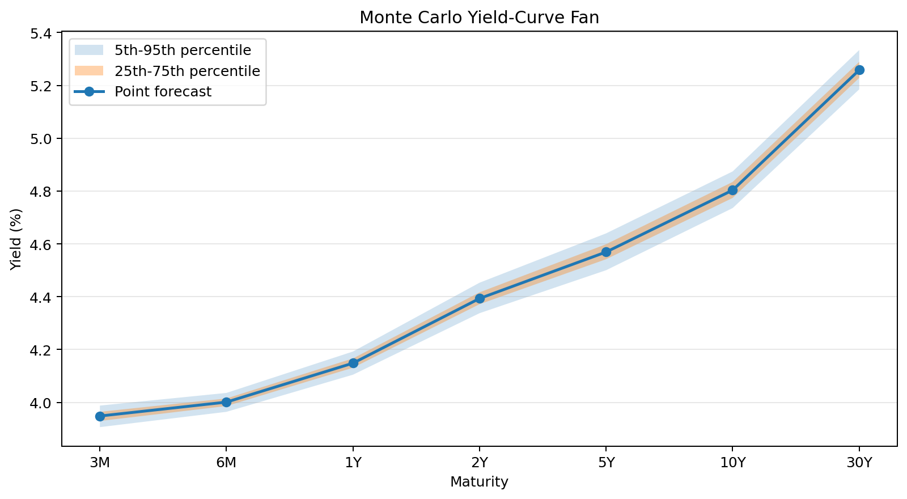

# Tresonance

**Leakage-aware U.S. Treasury yield-curve forecasting with PyTorch**

Tresonance is a leakage-aware PyTorch research project investigating whether
multi-frequency Treasury-market features improve one-day-ahead U.S. yield-curve
forecasts, with an experimental reinforcement-learning extension for 10Y
directional decision-making.

`PyTorch` · `pandas` · `scikit-learn` · `FRED Treasury data` · `time-series ML`

## Main Finding

Adding 5-day and 21-day trailing yield-change features did **not** improve the
LSTM forecast. The zero-change persistence baseline remained the strongest
overall supervised model on the held-out test period.

| model | test MAE (bp) | test RMSE (bp) |
|---|---:|---:|
| persistence zero-change | 3.679 | 5.457 |
| daily LSTM | 3.756 | 5.502 |
| multi-frequency LSTM | 3.805 | 5.544 |
| linear regression | 3.994 | 5.679 |

## Key Takeaways

- The project predicts a seven-dimensional next-day yield-change target across
  `3M`, `6M`, `1Y`, `2Y`, `5Y`, `10Y`, and `30Y` Treasury maturities using
  daily FRED data.
- The supervised experiment compares persistence, linear regression, a
  daily-feature LSTM, and a multi-frequency LSTM using chronological splits,
  trailing-only features, 60-trading-day windows, and train-only normalization.
- The negative result is meaningful: under this leakage-aware setup, added
  multi-frequency features increased model complexity without improving
  out-of-sample forecasting error.

## Research Question

Does adding 5-day and 21-day trailing yield-change information improve an LSTM
relative to daily-only features for one-day-ahead U.S. Treasury yield-curve
forecasting?

Multi-frequency Treasury-market features should help the LSTM capture movement
patterns that are not visible from daily yield levels and one-day changes alone.
The current results do not support this hypothesis.

## Dataset

| field | value |
|---|---|
| source | FRED daily Treasury constant-maturity yield series |
| period | approximately 1990-2026 |
| frequency | daily trading observations after cleaning and alignment |
| maturities | `3M`, `6M`, `1Y`, `2Y`, `5Y`, `10Y`, `30Y` |
| forecast horizon | one trading day |
| target | next-trading-day yield change for all seven maturities |
| sequence length | 60 trading days |

The cleaned dataset aligns the seven Treasury series by date, keeps complete
observations, and stores yields in percentage points. Each supervised target is
a seven-dimensional vector: the change in each maturity from forecast origin
date `t` to the next available trading date `t + 1`.



*Historical daily Treasury constant-maturity yields used for the forecasting
experiments. Source: `reports/figures/treasury_historical_yields.png`.*


## Methodology

The supervised pipeline converts daily Treasury yields into sequence examples
for one-day-ahead yield-change forecasting:


At forecast origin `t`, the model can use only information available through
date `t`: current yield levels and trailing 1-day, 5-day, and 21-day yield
changes. The label is the next-trading-day yield change from `t` to `t + 1`
for all seven maturities.

The daily-only LSTM uses yield levels plus 1-day trailing changes. The
multi-frequency LSTM uses yield levels plus 1-day, 5-day, and 21-day trailing
changes. Both use 60-trading-day historical windows and predict the same
seven-dimensional next-day target.

Splits are chronological rather than random because adjacent financial
time-series observations are highly dependent. Randomly mixing dates across
training and test sets would let the model train on observations surrounding
the evaluation period and would overstate out-of-sample performance.

Feature normalization is fitted on the training windows only, then applied
unchanged to validation and test windows. This prevents validation or test
distribution statistics from leaking into model training.

## Leakage Prevention

The supervised experiments are designed to avoid common time-series leakage:

- Samples are split chronologically into training, validation, and test sets;
  there is no random train/test shuffle across dates.
- Feature construction uses only yield levels at the forecast origin and
  trailing changes. No future row is included in an input window.
- Each sample ends at trading day `t` and predicts the yield change from `t` to
  `t + 1` for all seven maturities.
- Normalization parameters are fitted on training windows only, then reused for
  validation and test windows.
- Validation is used for model selection and early stopping; final MAE/RMSE are
  reported on the held-out test split.

The PyTorch training DataLoader shuffles batches within the training split for
optimization. This is not the same as randomly splitting the time series:
validation and test dates remain chronologically held out.

## Models Compared

| model | research role | input | output / target |
|---|---|---|---|
| persistence / zero-change baseline | Naive benchmark for daily yield-change forecasting | none beyond the target shape | zero next-day change across all seven maturities |
| linear regression | Simple supervised baseline | flattened 60-trading-day historical window | seven next-day yield changes |
| daily LSTM | Sequence-model baseline | yield levels plus 1-day trailing changes | seven next-day yield changes |
| multi-frequency LSTM | Main hypothesis test | yield levels plus 1-day, 5-day, and 21-day trailing changes | seven next-day yield changes |
| DQN | Experimental reinforcement-learning extension | 10Y directional state features | next-day 10Y FALL / FLAT / RISE decision |

The daily LSTM and multi-frequency LSTM form a matched ablation: they use the
same target, sequence length, split methodology, training objective, and model
family, while changing the feature set to isolate the effect of adding 5-day
and 21-day trailing yield changes.

The DQN addresses a separate 10Y directional decision problem, so its metrics
are reported separately from the MAE/RMSE regression results.

## Results

All metrics are reported in basis points and are generated from saved artifacts
under `reports/` or `results/`.

### Supervised Forecasting

Overall held-out test performance:

| model | MAE (bp) | RMSE (bp) |
|---|---:|---:|
| persistence | 3.679 | 5.457 |
| daily LSTM | 3.756 | 5.502 |
| multi-frequency LSTM | 3.805 | 5.544 |
| linear regression | 3.994 | 5.679 |

Under this dataset, feature set, architecture, training setup, and chronological
split, the zero-change persistence baseline was the strongest overall
supervised model. The central multi-frequency hypothesis was not supported: the
multi-frequency LSTM slightly underperformed the daily-only LSTM on both MAE
and RMSE.

This result does not show that multi-frequency Treasury features are generally
useless, or that LSTMs are ineffective for Treasury forecasting in general. It
shows that this particular multi-frequency feature design did not improve this
small LSTM relative to a daily-feature LSTM or persistence baseline.

Per-maturity results are saved in `reports/tables/ablation_results.csv` and
`reports/tables/baseline_results.csv`. In this run, test errors were smallest
at the short end of the curve and larger for intermediate and long maturities;
for example, persistence RMSE was `3.513 bp` for `3M`, `6.048 bp` for `10Y`,
and `5.438 bp` for `30Y`.

### Ablation Study

The main ablation changes the LSTM feature set while keeping the forecasting
target, 60-day sequence length, chronological split, training objective, and
model family conceptually fixed:

| LSTM variant | feature set | test MAE (bp) | test RMSE (bp) |
|---|---|---:|---:|
| daily LSTM | yield levels + 1-day changes | 3.756 | 5.502 |
| multi-frequency LSTM | yield levels + 1-day, 5-day, and 21-day changes | 3.805 | 5.544 |


*Test RMSE by maturity for the supervised baselines and LSTM ablation. Source:
`reports/figures/ablation_rmse_by_maturity.png`.*

This is more informative than comparing unrelated model families because the
main changed variable is the additional 5-day and 21-day trailing yield-change
information. In the current experiment, adding those features did not improve
test performance. This is an empirical result from this run, not causal proof
that multi-frequency features cannot help under other architectures, seeds, or
evaluation windows.

## Reinforcement Learning Extension

Tresonance also includes an experimental DQN reinforcement-learning extension
for sequential Treasury-direction decisions. The narrower task is to predict
whether the next-trading-day `10Y` Treasury yield move will be `FALL`, `FLAT`,
or `RISE`.

The DQN state contains five values available at decision time:

- current `10Y` Treasury yield
- `10Y` 1-day trailing change
- `10Y` 5-day trailing change
- `10Y` 21-day trailing change
- `10Y - 2Y` spread

The action space is `FALL`, `FLAT`, and `RISE`. The implemented reward is `+1`
when the chosen action matches the realized next-day `10Y` direction and `-1`
otherwise, using a `1 bp` threshold for the `FLAT` class.

The agent uses a neural Q-network, experience replay, a target network, and
epsilon-greedy exploration. Directional performance is compared on a common-date
test window against supervised models after their `10Y` numerical forecasts are
converted into the same direction classes.

Directional results from `reports/tables/rl_model_comparison.csv`:

| model | direction accuracy | average reward |
|---|---:|---:|
| persistence zero-change | 0.136 | -0.727 |
| linear regression | 0.337 | -0.326 |
| daily LSTM | 0.201 | -0.597 |
| multi-frequency LSTM | 0.264 | -0.471 |
| DQN | 0.448 | -0.103 |



*DQN direction confusion matrix on the common-date test window. Source:
`reports/figures/rl_confusion_matrix.png`.*

This is not an automated trading strategy or portfolio-optimization system.
Market transitions are exogenous here: the selected action does not influence
the next market state. The current formulation is therefore closer to
sequential directional decision-making than to a full control/trading
environment. A stronger future RL formulation would add position or exposure
state and use an economically meaningful PnL-style reward.

## Training And Inference

Training builds historical supervised windows, wraps them in a PyTorch
`Dataset`/`DataLoader`, runs the LSTM forward pass, computes MSE loss,
backpropagates with Adam, evaluates validation loss, and saves the best
checkpoint. Checkpoints include model weights, model configuration,
feature/target columns, lookback/horizon settings, and the training-only
normalization mean and scale.

Inference is a separate path: the saved checkpoint is loaded on CPU, the latest
valid 60-trading-day feature window is rebuilt from the Treasury data, the
stored normalization metadata is reapplied, and the trained model produces a
next-day forecast for all seven maturities. The inference command also records
basic runtime diagnostics such as parameter count and latency.

### Inference And Uncertainty

Inference metrics from `results/inference_metrics.json`:

| metric | value |
|---|---:|
| trainable parameters | 24,519 |
| single-sample latency | 0.5181 ms |
| batch latency, 64 samples | 7.5259 ms |

Uncertainty range examples from `reports/tables/uncertainty_ranges.csv`:

| maturity | 90% range width (bp) |
|---|---:|
| 3M | 8.157107 |
| 2Y | 11.536339 |
| 30Y | 14.869325 |



*Residual-covariance Monte Carlo yield-curve fan around the LSTM point forecast.
Source: `reports/figures/yield_curve_fan.png`.*

<details>
<summary><strong>Limitations</strong></summary>

- The main supervised result comes from one fixed historical
  train/validation/test split; walk-forward validation across regimes has not
  been implemented yet.
- Hyperparameter tuning is limited, and repeated-seed sensitivity analysis has
  not yet been used to quantify uncertainty in the model comparison.
- Raw maturity yields and trailing changes remain the primary representation;
  PCA or explicit level/slope/curvature factors have not yet been tested.
- Macroeconomic variables are not included. Adding them would require careful
  handling of release dates and data availability to avoid look-ahead leakage.
- The DQN environment is exogenous to the agent's actions, so the RL extension
  is closer to sequential directional decision-making than a full trading or
  control environment.
- Directional accuracy does not imply economic profitability, and the DQN is
  not evaluated as a trading strategy.
- The residual-covariance uncertainty simulation is a simple forecast-error
  scenario layer, not a full market-risk model.

</details>

<details>
<summary><strong>Future Work</strong></summary>

1. Add a ridge regression baseline to test whether regularized linear models
   improve on ordinary least squares and provide a stronger non-neural
   benchmark.
2. Test PCA or level/slope/curvature yield-curve representations to make the
   feature space more financially structured than raw maturities alone.
3. Add walk-forward chronological validation across market regimes to check
   whether the negative multi-frequency result is stable over time.
4. Run seed sensitivity experiments for the LSTMs and DQN to quantify how much
   conclusions depend on initialization and training noise.
5. Redesign the RL extension with position or exposure state and an
   economically meaningful PnL-style reward.

Transformer-style models are intentionally low priority until stronger
baselines, curve representations, and validation design are in place.

</details>

<details>
<summary><strong>Reproducibility</strong></summary>

Create a local environment and install the project in editable mode:

```bash
python3 -m venv .venv
source .venv/bin/activate
python -m pip install --upgrade pip
python -m pip install -e ".[dev]"
```

Run the test suite:

```bash
pytest
```

Prepare or refresh the cleaned FRED Treasury dataset:

```bash
download-treasury-data --start-date 1990-01-01
```

Run the supervised baselines:

```bash
evaluate-baselines
```

Train and evaluate the daily-vs-multi-frequency LSTM ablation:

```bash
run-ablation-study
```

Train the standalone LSTM checkpoint used by the inference command:

```bash
train-first-lstm
```

Run saved-model inference and uncertainty simulation:

```bash
run-lstm-inference
run-uncertainty-simulation
```

Optional exploratory figures:

```bash
explore-treasury-data
```

The DQN reinforcement-learning extension is implemented as a Python API rather
than a console script. To train the DQN checkpoint from the cleaned data:

```bash
python - <<'PY'
import pandas as pd

from market_resonance.data import DEFAULT_OUTPUT_PATH
from market_resonance.reinforcement import DQNTrainingConfig, train_dqn_agent

frame = pd.read_csv(DEFAULT_OUTPUT_PATH, parse_dates=["date"])
run = train_dqn_agent(frame, config=DQNTrainingConfig(seed=42))
print(run.metadata)
PY
```

Saved artifact locations:

| artifact type | location |
|---|---|
| cleaned data | `data/processed/treasury_yields_daily.csv` |
| trained checkpoints | `reports/models/` |
| result tables | `reports/tables/` |
| figures | `reports/figures/` |
| JSON/CSV experiment outputs and predictions | `results/` |

</details>

<details>
<summary><strong>Repository Structure</strong></summary>

```text
tresonance/
├── configs/                  # experiment defaults
├── data/                     # raw/interim/processed data locations
├── docs/                     # research notes and background
├── notebooks/                # exploratory walkthroughs
├── reports/                  # figures, tables, model checkpoints
├── results/                  # JSON/CSV experiment outputs
├── src/market_resonance/
│   ├── data/                 # FRED download, cleaning, validation
│   ├── features/             # feature construction and windowing
│   ├── models/               # PyTorch model definitions
│   ├── training/             # DataLoaders, training loops, checkpoints
│   ├── evaluation/           # baselines, ablations, metrics
│   ├── inference/            # saved-model inference and uncertainty
│   └── reinforcement/        # DQN environment, replay buffer, evaluation
├── tests/                    # regression tests for data/model contracts
├── README.md
└── pyproject.toml
```

</details>

<details>
<summary><strong>Docs</strong></summary>

| document | description |
|---|---|
| `docs/00_abstract.md` | Project abstract and high-level research summary. |
| `docs/01_finance_primer.md` | Background on Treasuries, yields, maturities, basis points, and yield curves. |
| `docs/02_research_question.md` | Research question, hypothesis, target definition, and evaluation framing. |
| `docs/03_data_and_multi_frequency_features.md` | FRED data source, maturities, feature sets, supervised windows, and leakage controls. |
| `docs/04_pytorch_and_model_architecture.md` | Baselines, LSTM architecture, tensor shapes, and model rationale. |
| `docs/05_training.md` | Training loop concepts, DataLoader usage, loss, optimization, early stopping, and checkpoints. |
| `docs/06_inference.md` | Difference between training and inference, saved-model loading, and forecast output. |
| `docs/07_ablation_study.md` | Daily vs multi-frequency LSTM ablation design and result. |
| `docs/08_stochastic_uncertainty.md` | Residual-covariance Monte Carlo uncertainty method and assumptions. |
| `docs/09_results_and_failure_modes.md` | Consolidated results, negative findings, and modeling limitations. |
| `docs/10_ml_systems_notes.md` | ML systems organization, artifact policy, and reproducibility notes. |
| `docs/11_reinforcement_learning.md` | DQN extension, state/action/reward design, evaluation, and limitations. |
| `docs/architecture.md` | Original architecture and research plan for the project. |
| `docs/time_value_of_money_example.md` | Educational discounting example connecting forecasted rates to present value. |

</details>
