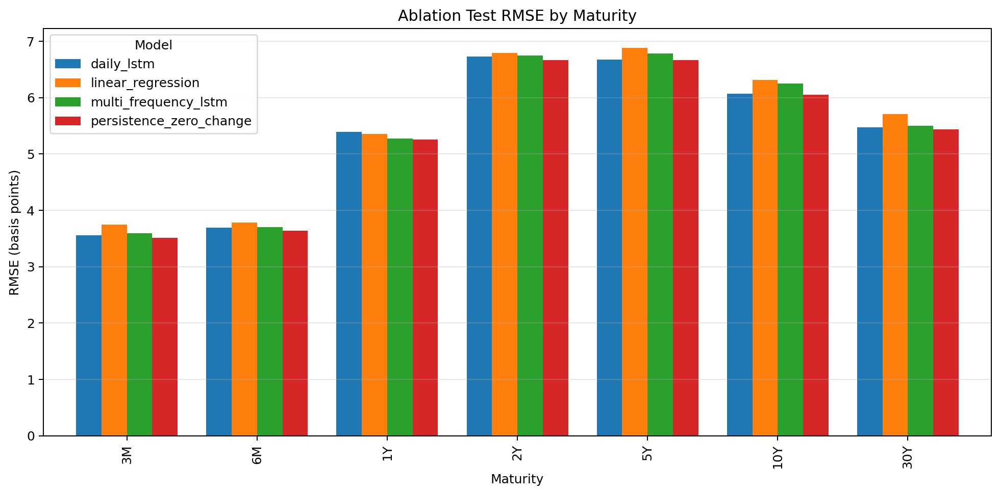
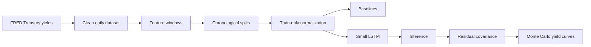

# Tresonance

**Multi-frequency neural Treasury yield-curve forecasting with PyTorch**

Tresonance is a compact research project studying whether
multi-frequency Treasury yield features improve one-trading-day-ahead
yield-curve forecasts over simple baselines.

## Research Question

Do 5-day and 21-day yield-change features improve a small LSTM forecast beyond
daily yield levels and 1-day changes?

The seven forecast maturities are:

`3M`, `6M`, `1Y`, `2Y`, `5Y`, `10Y`, and `30Y`.

## Key Figure



The ablation result did **not** support the multi-frequency hypothesis in this
run.

## Methodology



## Results

All values are generated artifacts in `reports/` or `results/`.

| model | test MAE (bp) | test RMSE (bp) |
|---|---:|---:|
| persistence zero-change | 3.679 | 5.457 |
| daily LSTM | 3.756 | 5.502 |
| multi-frequency LSTM | 3.805 | 5.544 |
| linear regression | 3.994 | 5.679 |

Inference metrics from `results/inference_metrics.json`:

| metric | value |
|---|---:|
| trainable parameters | 24,519 |
| single-sample latency | 0.5181 ms |
| batch latency, 64 samples | 7.5259 ms |

Uncertainty range examples from `reports/tables/uncertainty_ranges.csv`:

| maturity | 90% range width (bp) |
|---|---:|
| 3M | 8.157107 |
| 2Y | 11.536339 |
| 30Y | 14.869325 |

## Strongest Findings

- The zero-change persistence baseline was difficult to beat.
- The daily-only LSTM slightly outperformed the multi-frequency LSTM.
- The multi-frequency hypothesis was not supported in this run.
- Linear regression performed worse than persistence and both LSTMs overall.
- Validation residual covariance can produce a simple probabilistic forecast,
  but the assumptions are intentionally modest.

## Limitations

- This is a small educational LSTM, not a tuned production model.
- The target horizon is one trading day.
- Daily Treasury yield changes are noisy and often close to zero.
- Constant-maturity/par yields are not an exact zero-coupon discount curve.
- The stochastic simulation assumes validation residuals are representative and
  approximately multivariate normal.
- The discounting example in the docs is an illustrative approximation, not bond
  pricing.

## Reproducibility

Set up an environment:

```bash
python3 -m venv .venv
source .venv/bin/activate
python -m pip install --upgrade pip
python -m pip install -e ".[dev]"
```

Run checks:

```bash
PYTHONPATH=src pytest
ruff check .
```

Regenerate the main artifacts:

```bash
download-treasury-data --start-date 1990-01-01
explore-treasury-data
evaluate-baselines
train-first-lstm --max-epochs 1 --patience 1
run-lstm-inference
run-ablation-study
run-uncertainty-simulation
```

## Repository Structure

```text
configs/                         experiment defaults
data/                            raw/interim/processed data locations
docs/                            research-style documentation
notebooks/                       educational walkthrough notebooks
reports/figures/                 generated figures
reports/models/                  saved model checkpoints
reports/tables/                  generated result tables
results/                         JSON and CSV experiment outputs
src/market_resonance/data/       data loading and validation
src/market_resonance/features/   supervised windows and normalization
src/market_resonance/models/     PyTorch model definitions
src/market_resonance/training/   training loops and checkpoints
src/market_resonance/evaluation/ baselines and ablations
src/market_resonance/inference/  inference and uncertainty simulation
tests/                           focused regression tests
```

## Documentation Map

- `docs/00_abstract.md`
- `docs/01_finance_primer.md`
- `docs/02_research_question.md`
- `docs/03_data_and_multi_frequency_features.md`
- `docs/04_pytorch_and_model_architecture.md`
- `docs/05_training.md`
- `docs/06_inference.md`
- `docs/07_ablation_study.md`
- `docs/08_stochastic_uncertainty.md`
- `docs/09_results_and_failure_modes.md`
- `docs/10_ml_systems_notes.md`
- `docs/time_value_of_money_example.md`
