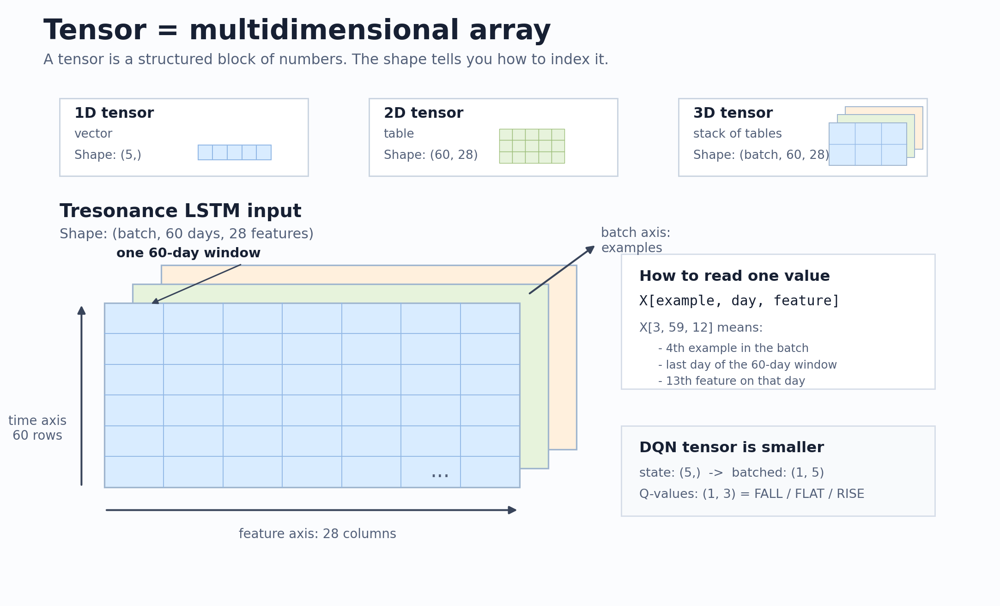
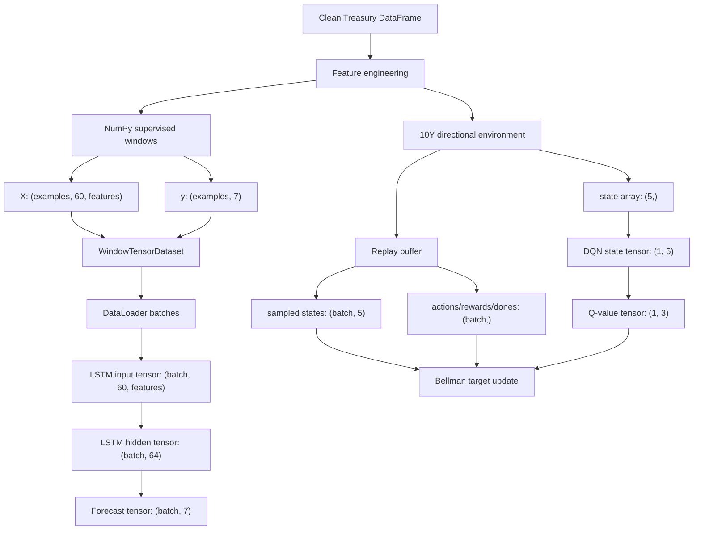

# PyTorch and Model Architecture

The neural model is intentionally small so the mechanics are easy to inspect.

## Baseline Context

Before using the LSTM, the project evaluates simple baselines. Baselines are
critical because a complex model is only useful if it improves on simple,
transparent alternatives under the same data split and metrics.

The zero-change baseline predicts no next-day yield move. The linear regression
baseline uses a weighted combination of the same historical feature window.
Errors are reported in basis points using MAE, RMSE, and per-maturity metrics.

Current overall test results:

| model | MAE (bp) | RMSE (bp) |
|---|---:|---:|
| zero-change | 3.679 | 5.457 |
| linear regression | 3.994 | 5.679 |

On this split, persistence is slightly stronger than linear regression, which
is a useful warning about how noisy daily yield changes are.

## LSTM

The model is a one-layer PyTorch LSTM followed by a linear output layer:

- `input_size`: number of input features
- `hidden_size`: 64
- `num_layers`: 1
- `output_size`: 7

For a batch of 64 multi-frequency examples:

| Step | Shape |
|---|---:|
| Input batch | `(64, 60, 28)` |
| LSTM sequence output | `(64, 60, 64)` |
| Final hidden state | `(64, 64)` |
| Linear output | `(64, 7)` |

## Where Tensors Show Up

Tresonance starts with pandas DataFrames and NumPy arrays. Tensors enter when
the data is handed to PyTorch models or optimizers.

## What Is A Tensor?

A tensor is a rectangular block of numbers with one or more dimensions. In this
project, tensors are the format PyTorch models expect.

You can think of a tensor shape as an address system:

- first dimension: which example in the batch
- second dimension: which day in the lookback window
- third dimension: which feature on that day

For the multi-frequency LSTM, one input batch has shape `(batch, 60, 28)`.
That means:

```text
X[example, day, feature]
```

For example:

```text
X[3, 59, 12]
```

means "for the fourth example in the batch, on the last day of its 60-day
window, read feature number 13."

## Tensor Shape Visual



The LSTM sees a stack of small tables. Each table is one example, each row is
one day in the 60-day lookback window, and each column is one feature.

The target tensor is simpler:

```text
y[example, maturity]

                 7 maturities
          ┌───────────────────────┐
example 1 │ 3M 6M 1Y 2Y 5Y 10Y 30Y│
example 2 │ 3M 6M 1Y 2Y 5Y 10Y 30Y│
   ...    │          ...          │
example B │ 3M 6M 1Y 2Y 5Y 10Y 30Y│
          └───────────────────────┘

Shape: (batch, 7)
```

The DQN sees a thinner table because it only makes a 10Y direction decision for
one date at a time:

```text
state = [
  current 10Y level,
  1-day 10Y change,
  5-day 10Y change,
  21-day 10Y change,
  2Y-10Y spread,
]

Shape before batching: (5,)
Shape sent to DQN:     (1, 5)
Output Q-values:       (1, 3)
                       FALL, FLAT, RISE
```

The reason for batching is efficiency and consistency. Even when the DQN looks
at one state, PyTorch layers expect a batch dimension, so one state becomes
`(1, 5)` rather than just `(5,)`.



The main tensor contracts are:

| Location | Tensor | Shape | Meaning |
|---|---|---:|---|
| Supervised LSTM training | `X` | `(batch, 60, 28)` | 60-day multi-frequency feature windows |
| Supervised LSTM training | `y` | `(batch, 7)` | next-day yield changes for all maturities |
| LSTM forward pass | `predictions` | `(batch, 7)` | numerical yield-change forecasts |
| DQN action selection | `state` | `(1, 5)` | one 10Y directional state |
| DQN forward pass | `q_values` | `(1, 3)` | FALL/FLAT/RISE action values |
| Replay training | `states` | `(batch, 5)` | sampled training-period states |
| Replay training | `actions`, `rewards`, `dones` | `(batch,)` | Bellman-update fields |

The important distinction is that the LSTM tensor represents a 60-day sequence
and returns numerical yield-change forecasts, while the DQN tensor represents a
single 10Y directional state and returns three action values.

## Parameters

The saved inference model reports `24,519` trainable parameters in
`results/inference_metrics.json`.

## Why LSTM?

An LSTM can read a sequence of historical yield-curve features and compress the
last 60 trading days into a hidden state. The model then maps that hidden state
to seven predicted yield changes.

This is not presented as an optimal architecture. It is the first neural model
in a controlled research pipeline.
